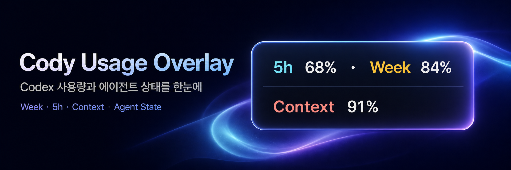

<p align="center">
  
</p>

# Cody Usage Overlay

[](https://github.com/prestige-kim/cody-usage-overlay/actions/workflows/ci.yml)
[](https://github.com/prestige-kim/cody-usage-overlay/releases)
[](https://github.com/prestige-kim/cody-usage-overlay/releases)

ChatGPT 데스크톱 앱의 Codex 사용량과 현재 에이전트 상태를 한눈에 보여주는 작은 오버레이입니다.

- `Week`: 주간 사용 가능량
- `5h`: 5시간 사용 가능량. 값이 없으면 숨김
- `Context`: 현재 작업의 컨텍스트 잔여율
- `Cody State Language`: 고정된 Cody 아이콘 뒤의 유체 색상 애니메이션으로 준비·생각·도구 실행·입력 대기·완료·오류 상태 표시
- `Agent Pulse`: 최근 5분간 에이전트의 진행 품질을 원활·활발·과부하·정체·불안정·마무리 배경 흐름으로 요약

오버레이는 Cody 펫 없이도 독립적으로 사용할 수 있습니다. 화면의 원하는 위치에 둘 수 있으며, 사용량·리셋 타이머·에이전트 상태 표현은 펫 연동 여부와 관계없이 동일하게 동작합니다.

> OpenAI 공식 앱은 아닙니다. Codex의 로컬 인터페이스를 사용하므로 ChatGPT 업데이트에 따라 동작이 달라질 수 있습니다.

## 지원 환경

| 운영체제 | 지원 대상 |
| --- | --- |
| macOS | macOS 14 이상, Apple Silicon |
| Windows | Windows 11, x64 |

Codex를 사용할 수 있는 ChatGPT 데스크톱 앱이 설치되어 있어야 합니다. 앱에 포함된 Codex 실행 파일을 먼저 찾고, 없으면 공식 Codex CLI 경로를 확인합니다.

## 설치

### macOS

1. [Releases](https://github.com/prestige-kim/cody-usage-overlay/releases)에서 최신 `CodyUsageOverlay-*-arm64.zip`을 받습니다.
2. 압축을 풀고 `Install.command`를 실행합니다.
3. macOS가 차단하면 `Install.command`를 Control-클릭한 뒤 **열기**를 선택합니다.

설치가 끝나면 앱이 자동으로 시작되며 메뉴 막대에 발바닥 아이콘이 나타납니다. 설치 위치는 `~/Applications/CodyUsageOverlay.app`이고, 다음 로그인부터 자동으로 실행됩니다.

릴리스 ZIP과 `.sha256` 파일을 같은 폴더에 받았다면 설치 전에 체크섬을 확인할 수 있습니다.

```bash
shasum -a 256 -c CodyUsageOverlay-*-arm64.zip.sha256
```

### Windows 11

PowerShell에서 아래 명령을 실행합니다. 최신 Windows x64 배포본을 받고 체크섬을 확인한 뒤 설치합니다.

```powershell
irm https://raw.githubusercontent.com/prestige-kim/cody-usage-overlay/main/windows/scripts/install.ps1 | iex
```

직접 설치하려면 Releases에서 `CodyUsageOverlay-*-windows-x64.zip`을 받아 `install.ps1`을 실행하세요. 설치 위치는 `%LOCALAPPDATA%\CodyUsageOverlay`이며 관리자 권한은 필요하지 않습니다.

## 사용

- 창을 원하는 위치로 드래그하면 위치가 저장됩니다.
- 왼쪽 위 `×`는 앱을 종료하지 않고 창만 숨깁니다.
- 왼쪽 아래 시계 버튼을 누르면 5시간·주간 한도의 리셋까지 남은 시간이 표시됩니다. 다시 누르면 즉시 닫히고, 그대로 두면 8초 후 사용량 화면으로 돌아갑니다.
- 오른쪽에 고정된 Cody 아이콘에서 오버레이 배경 대부분으로 퍼지는 유체 색상 애니메이션은 현재 작업 상태를 나타냅니다. 마우스를 올리면 한국어 상태명이 즉시 표시되고, 클릭하면 3초간 고정됩니다.
- 중앙부터 Cody 앞까지 은은하게 움직이는 무채색 배경 광류는 최근 에이전트 흐름을 나타냅니다. Cody State의 전체 배경 색상과 겹치지 않도록 Agent Pulse는 속도·밀도·밝기만 바꿉니다. 해당 배경 구역에 마우스를 올리면 `Agent Pulse` 상태와 도구 호출 급증·진행 공백·오류·컨텍스트 소모 같은 판정 원인이 표시되고, 클릭하면 3초간 고정됩니다.
- 다시 보려면 메뉴 막대의 발바닥 아이콘에서 `오버레이 표시`를 켜세요.
- 메뉴 막대나 우클릭 메뉴에서 클릭 통과, 항상 위, 위치 초기화, 선택적 Cody 자동 추적, 진단 정보 복사, 종료를 선택할 수 있습니다.
- 메뉴의 `종료`를 누른 뒤에는 Spotlight에서 `Cody Usage Overlay`를 실행하거나 터미널에서 `open "$HOME/Applications/CodyUsageOverlay.app"`을 실행하세요. 다음 로그인 때도 자동으로 시작됩니다.

### 선택적 Cody 펫 연동

메뉴 막대에서 `Cody 따라가기`를 켜면 펫 창이 보일 때 오버레이가 함께 이동하고 작업 알림의 반대편에 배치됩니다. 펫을 사용하지 않거나 감지하지 못해도 오버레이의 핵심 기능과 저장 위치에는 영향이 없습니다.

`Context 100%`는 컨텍스트를 거의 쓰지 않은 상태이고, `0%`에 가까울수록 한도에 가까운 상태입니다. Week·5h와는 별개의 값입니다.

## 진단

값이 `—`로 남거나 선택적 자동 추적이 동작하지 않으면 진단 스크립트를 실행하세요.

```bash
# macOS
./scripts/doctor.sh
```

```powershell
# Windows
./windows/scripts/doctor.ps1
```

배포 ZIP에는 macOS용 `Doctor.command`와 Windows용 `doctor.ps1`도 들어 있습니다. 문제를 공유할 때는 사용자 이름이나 개인 경로를 가려 주세요.

## 개인정보

Week와 5h는 로컬 `codex app-server --stdio`에서 읽습니다. Context, Cody 상태, Agent Pulse는 `~/.codex/sessions`의 토큰 사용량 및 작업 생명주기 기록으로 계산합니다.

- API 키나 별도 로그인이 필요하지 않습니다.
- 세션 JSONL을 로컬 메모리에서 훑어 토큰 카운터와 작업 이벤트의 종류·상태만 추출하며, 프롬프트·응답·명령 내용·인증 토큰을 저장하거나 외부로 보내지 않습니다.
- 사용량 숫자를 디스크나 외부 서버로 보내지 않습니다.

자세한 내용은 [PRIVACY.md](PRIVACY.md)를 참고하세요.

## 소스에서 빌드

macOS에는 Swift 6와 Xcode Command Line Tools가 필요합니다.

```bash
./scripts/check.sh
./scripts/build.sh
./scripts/install.sh
```

Windows에는 .NET 8 SDK가 필요합니다.

```powershell
dotnet build windows/CodyUsageOverlay.Windows.sln -c Release
dotnet run --project windows/tests/CodyUsageOverlay.Checks/CodyUsageOverlay.Checks.csproj -c Release
./windows/scripts/package.ps1
```

## 삭제

```bash
# macOS
./scripts/uninstall.sh
./scripts/uninstall.sh --purge
```

```powershell
# Windows
./windows/scripts/uninstall.ps1
./windows/scripts/uninstall.ps1 -Purge
```

`purge`를 사용하지 않으면 설정과 로그는 남겨 둡니다.

## 알려진 제한 사항

- Codex app-server와 rollout 형식이 바뀌면 사용량 표시가 동작하지 않을 수 있습니다.
- Cody 자동 추적은 ChatGPT의 비공개 창 구조를 읽는 호환성 기능입니다. 향후 앱 업데이트로 다시 달라질 수 있으며, 이 경우 메뉴 막대에서 자동 추적을 끄고 고정 위치 모드를 사용할 수 있습니다.
- Windows의 Cody 창 감지는 아직 실기기 검증 중입니다.
- macOS 앱은 서명·공증되지 않았습니다.
- Windows 앱은 코드 서명되지 않아 SmartScreen 경고가 나올 수 있습니다.

## 문서

[변경 기록](CHANGELOG.md) · [기여 안내](CONTRIBUTING.md) · [보안 정책](SECURITY.md) · [서드파티 고지](THIRD_PARTY_NOTICES.md) · [MIT License](LICENSE)
